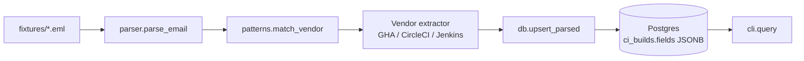

# ci-email-scraper


[](LICENSE)

Open-source reference implementation of the "HTML email → JSONB" pattern, using synthetic CI/CD build notifications (GitHub Actions, CircleCI, Jenkins) as the demo domain.

## The Pattern

CI/CD platforms email a build summary on every job. These emails are searchable in your inbox but useless once you want trends, cross-repo views, or programmatic analysis. This repo demonstrates the parser pattern that turns those emails into queryable structured data — without committing to a fixed schema that breaks every time the email format changes.

The same pattern, against real Gmail at production scale, runs in a private repo at my employer. This is a clean-room implementation against synthetic CI/CD emails so the architecture is verifiable.

## Architecture



Three core moves:
1. **Ordered header patterns** identify the CI vendor from subject + From-header. Longer/more-specific patterns are checked first to avoid prefix collisions.
2. **Hidden-span removal + word-rejoin** cleans up tracking pixel spans that `BeautifulSoup.get_text()` would otherwise split words across.
3. **Dynamic JSONB column** absorbs vendor-specific fields without schema migration.

## Quick Start

```bash
git clone https://github.com/Jamil1016/gmail-scraper
cd gmail-scraper
docker compose up -d
pip install -e .
cp .env.example .env  # default DATABASE_URL works with docker-compose
python -m ci_email_scraper init-db
python -m ci_email_scraper run
python -m ci_email_scraper query --status failure
```

## How It Works

See `ci_email_scraper/parser.py` for the parser core, `patterns.py` for vendor detection, `db.py` for the asyncpg-based upsert layer.

## Tests

```bash
pytest                              # all tests
SKIP_INTEGRATION_TESTS=1 pytest     # unit only (no Postgres container needed)
pytest --cov                        # with coverage
```

| Test file | Covers |
|---|---|
| `test_patterns.py` | Vendor detection + prefix disambiguation |
| `test_dirty_html.py` | Hidden-span removal + word rejoin |
| `test_parser.py` | Full per-vendor parse against fixtures |
| `test_upsert.py` | Idempotency + JSONB round-trip (testcontainers) |
| `test_cli.py` | CLI argument parsing + command dispatch |

## Background

I built this pattern at scale at $WORK (private repo). The case study with production metrics is at:
**https://portfolio-gules-gamma-14.vercel.app/projects/gmail-scraper**

## License

MIT
